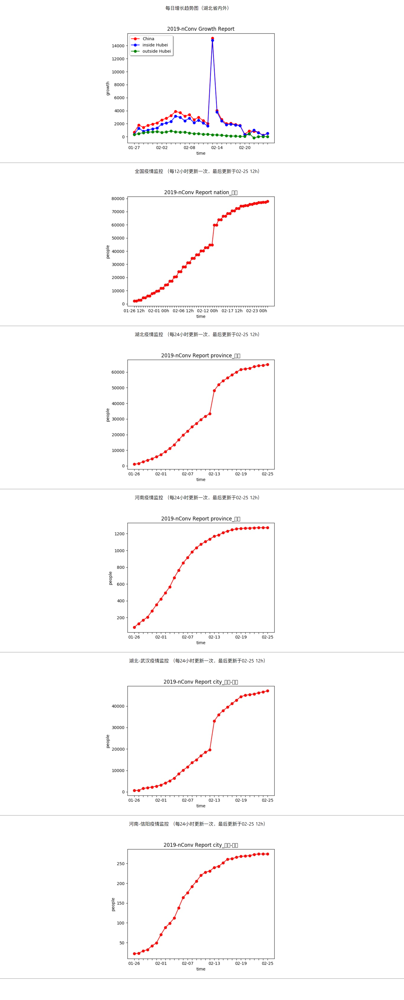

This repo is made for real-time tracking of virus 2019-nCoV.

Show the report on a web page.



## StartUp

1. Edit the `config.json` file to make your own setting.
```
{
    "startTime": "2020-01-26 12h",
    "monitorList":
    [
        {
            "name": "全国",
            "level": "nation",
            "interval": 12,
            "lastUpdate": "02-03 12h"
        }
        ...
    ]
}
```
2. `nohup python3 spider/scheduler.py`
3. `nohup http-server ./web`


> Requirements: Need some preparations for this program.
>
> 1. [`http-server`](https://blog.csdn.net/qq_37928350/article/details/81166873) in Node
> 2. some python requirements for spider

## Code 

### ./spider

The entrance of spider program is in `scheduler.py`. You can schedule your plot for any region at any interval by calling `schedulePlot()`.

### ./web

We use `http-server` in Node to show the output image in `index.html`.